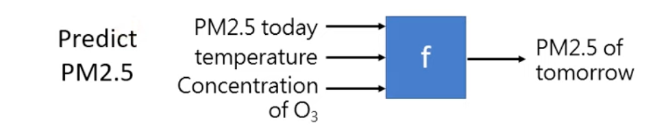

<!-- 
**** Author: ZerrorLiu  ****
****   Date: 2022/04/09 ****
 -->

# ***Lecture 1: Introduction of Machine / Deep Learning***

## 1. What is *Machine Learning*

> ≈ Looking for a FUNCTION

## 2. Different types of functions

### 2.1 Regression



```c++
#include<iostream>
using namespace std;
int main() {
    int i = 0;
    cout << i;
    return 0;
}
```
